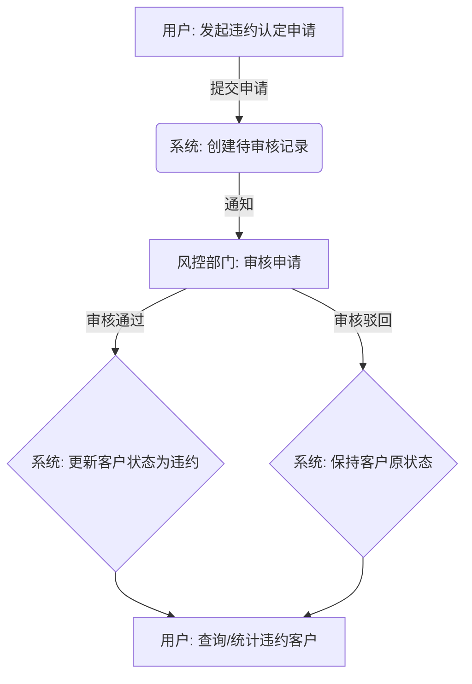

# XQuant 违约客户管理系统

## 1. 概述
本项目是 **XQuant 违约客户管理系统** 的后端服务。系统旨在解决金融领域中对违约客户的认定、审核、管理和统计分析的需求。

违约是指融资主体、发行人或者交易对手客户违反交易规则、合同约定的情形，未能在规定期限内了结债务，或未能按照合约规定支付或延期支付利息或本金的行为。本系统专注于**人工认定**流程，支持用户根据潜在的违约原因发起认定申请，并由风控部门进行审核，实现对违约客户生命周期的全面管理。

## 2. 核心功能
- **用户认证与授权**: 基于 JWT (JSON Web Token) 的安全认证机制。
- **违约原因维护**: 支持对违约原因和重生原因进行增删改查，为认定提供依据。
- **违约认定申请**: 允许用户发起对特定客户的违约认定申请。
- **风控审核流程**: 提供给风控部门对待审核申请进行审批（通过/驳回）的功能。
- **信息查询**: 支持多维度查询所有待审核和已审核的违约客户信息。
- **违约重生处理**: 对满足特定条件的违约客户进行“重生”操作，恢复其正常状态。
- **统计分析**: 提供按行业、区域等多维度对违约客户进行统计的功能。

## 3. 核心业务流程
系统核心的违约认定流程如下：


## 4. 技术栈
- **后端语言**: Go
- **Web 框架**: Gin
- **数据库**: PostgreSQL
- **容器化**: Docker, Docker Compose
- **API 文档**: Swagger (via Swag)
- **配置管理**: Viper
- **身份认证**: JWT

## 5. 项目结构
```
.
├── cmd/server/main.go      # 程序入口
├── configs                 # 配置文件目录
├── docs                    # Swagger API 文档
├── internal                # 项目内部代码
│   ├── api                 # API 数据传输对象 (DTO)
│   ├── config              # 配置加载
│   ├── core                # 核心业务模型
│   ├── database            # 数据库连接
│   ├── handler             # HTTP 请求处理器 (Controller)
│   ├── middleware          # 中间件 (认证, RBAC)
│   ├── repository          # 数据仓库 (数据库操作)
│   ├── service             # 业务逻辑层
│   └── utils               # 工具类 (JWT, 加密等)
├── go.mod                  # Go 模块文件
└── docker-compose.yml      # Docker Compose 配置文件
```

## 6. 快速开始
请确保你的开发环境已经安装了 **Go** (推荐 1.18+) 和 **Docker**。

### 步骤 1: 克隆代码库
```bash
git clone <your-repo-url>
cd <project-directory>
```

### 步骤 2: 启动数据库
本项目使用 Docker Compose 管理数据库。在项目根目录下运行：
```bash
docker-compose up -d
```
该命令将在后台启动一个 PostgreSQL 容器。

### 步骤 3: 配置应用程序
复制示例配置文件，并根据需要进行修改。对于本地开发，默认配置通常可以直接使用。
```bash
cp configs/config.example.yaml configs/config.yaml
```

### 步骤 4: 安装依赖并运行
```bash
go mod tidy
go run cmd/server/main.go
```
服务启动后，默认监听 `8080` 端口。

## 7. 配置说明
应用的配置位于 `configs/config.yaml` 文件中：

- `SERVER_PORT`: 应用服务监听的端口。
- `DB_HOST`: 数据库主机地址。
- `DB_PORT`: 数据库端口。
- `DB_USER`: 数据库用户名。
- `DB_PASSWORD`: 数据库密码。
- `DB_NAME`: 数据库名称。
- `JWT_SECRET`: 用于签发和验证 JWT 的密钥。
- `TOKEN_TTL`: JWT 的有效时间（小时）。

## 8. API 文档
服务启动后，在浏览器中打开以下地址即可查看和测试 API：

[http://localhost:8080/api/v1/swagger/index.html](http://localhost:8080/api/v1/swagger/index.html)


