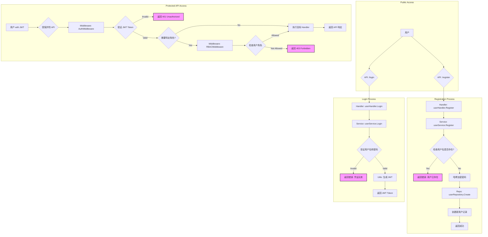
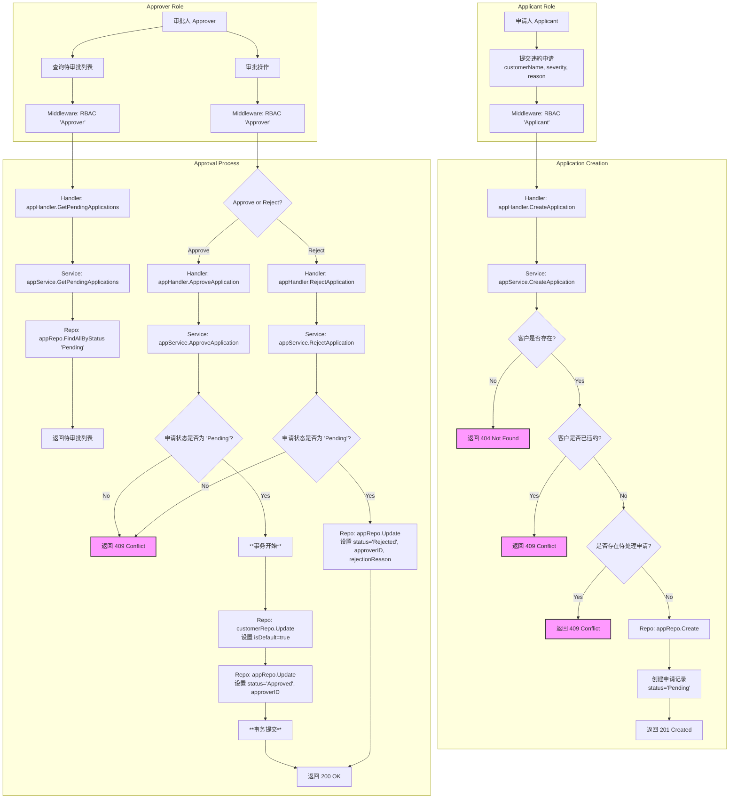
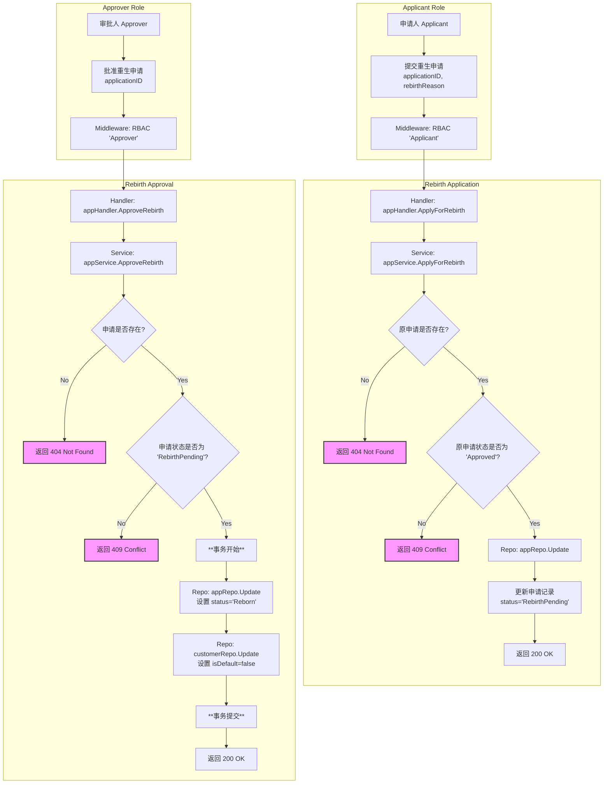
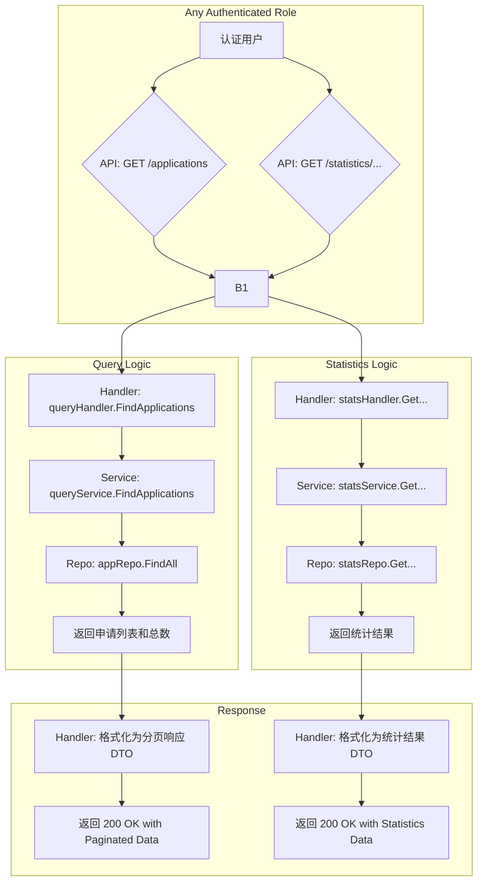

# 业务流程总览

本文档整合了系统的核心业务流程，包括用户认证、违约申请、重生申请以及数据查询与统计。

---

# 1. 用户认证业务流程

## 流程图 (Mermaid)

## 关键代码点

*   **路由定义**: [`cmd/server/main.go`](cmd/server/main.go:115)
*   **用户 Handler**: [`internal/handler/user_handler.go`](internal/handler/user_handler.go)
*   **用户 Service**: [`internal/service/user_service.go`](internal/service/user_service.go)
*   **认证中间件**: [`internal/middleware/auth_middleware.go`](internal/middleware/auth_middleware.go)
*   **授权中间件**: [`internal/middleware/rbac_middleware.go`](internal/middleware/rbac_middleware.go)
*   **JWT 工具**: [`internal/utils/jwt.go`](internal/utils/jwt.go)
*   **密码加密**: [`internal/utils/crypto.go`](internal/utils/crypto.go)

---

# 2. 违约申请业务流程

## 流程图 (Mermaid)

## 关键代码点

*   **路由定义**: [`cmd/server/main.go`](cmd/server/main.go:162)
*   **申请 Handler**: [`internal/handler/application_handler.go`](internal/handler/application_handler.go)
*   **申请 Service**: [`internal/service/application_service.go`](internal/service/application_service.go)
*   **数据模型**: [`internal/core/model.go`](internal/core/model.go)

---

# 3. 重生申请业务流程

## 流程图 (Mermaid)

## 关键代码点

*   **路由定义**: [`cmd/server/main.go`](cmd/server/main.go:175)
*   **申请 Handler**: [`internal/handler/application_handler.go`](internal/handler/application_handler.go)
*   **申请 Service**: [`internal/service/application_service.go`](internal/service/application_service.go)

---

# 4. 数据查询与统计业务流程

## 流程图 (Mermaid)

## 关键代码点

*   **查询路由**: [`cmd/server/main.go`](cmd/server/main.go:160)
*   **统计路由**: [`cmd/server/main.go`](cmd/server/main.go:184)
*   **查询 Handler**: [`internal/handler/query_handler.go`](internal/handler/query_handler.go)
*   **统计 Handler**: [`internal/handler/statistics_handler.go`](internal/handler/statistics_handler.go)
*   **查询 Service**: [`internal/service/query_service.go`](internal/service/query_service.go)
*   **统计 Service**: [`internal/service/statistics_service.go`](internal/service/statistics_service.go)