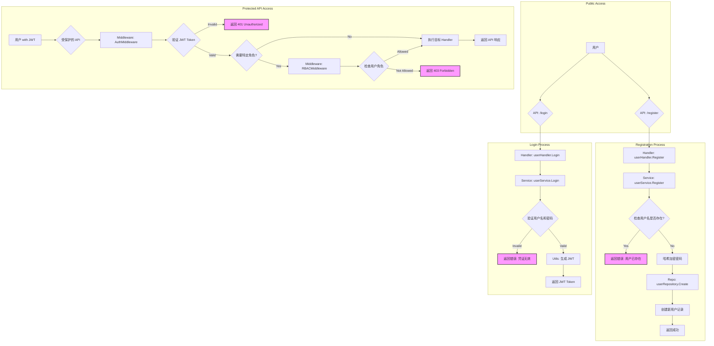

# 1. 用户认证业务流程

## 流程图 (Mermaid)

## 关键代码点

*   **路由定义**: [`cmd/server/main.go`](cmd/server/main.go:115)
*   **用户 Handler**: [`internal/handler/user_handler.go`](internal/handler/user_handler.go)
*   **用户 Service**: [`internal/service/user_service.go`](internal/service/user_service.go)
*   **认证中间件**: [`internal/middleware/auth_middleware.go`](internal/middleware/auth_middleware.go)
*   **授权中间件**: [`internal/middleware/rbac_middleware.go`](internal/middleware/rbac_middleware.go)
*   **JWT 工具**: [`internal/utils/jwt.go`](internal/utils/jwt.go)
*   **密码加密**: [`internal/utils/crypto.go`](internal/utils/crypto.go)
