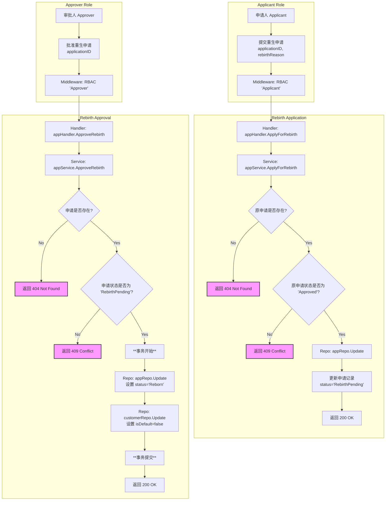

# 3. 重生申请业务流程

## 流程图 (Mermaid)

## 关键代码点

*   **路由定义**: [`cmd/server/main.go`](cmd/server/main.go:175)
*   **申请 Handler**: [`internal/handler/application_handler.go`](internal/handler/application_handler.go)
*   **申请 Service**: [`internal/service/application_service.go`](internal/service/application_service.go)
