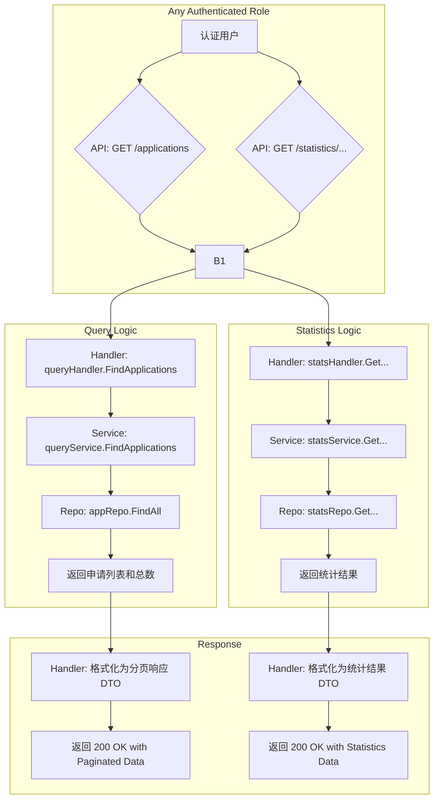

# 4. 数据查询与统计业务流程

## 流程图 (Mermaid)

## 关键代码点

*   **查询路由**: [`cmd/server/main.go`](cmd/server/main.go:160)
*   **统计路由**: [`cmd/server/main.go`](cmd/server/main.go:184)
*   **查询 Handler**: [`internal/handler/query_handler.go`](internal/handler/query_handler.go)
*   **统计 Handler**: [`internal/handler/statistics_handler.go`](internal/handler/statistics_handler.go)
*   **查询 Service**: [`internal/service/query_service.go`](internal/service/query_service.go)
*   **统计 Service**: [`internal/service/statistics_service.go`](internal/service/statistics_service.go)
